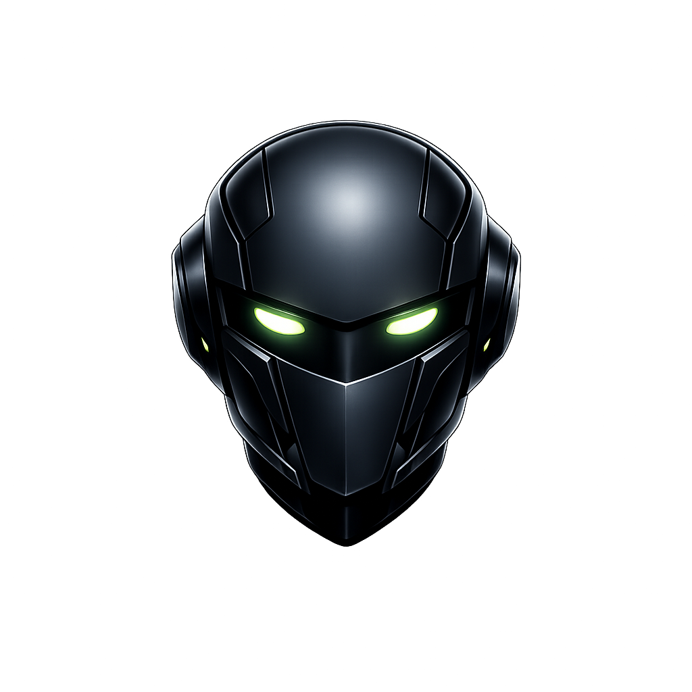

# VanguardIA Chatbot - Setup & Configuration

## Overview
VanguardIA is a sales funnel AI chatbot integrated into the VanguardCrux website. It uses the Grok API to provide intelligent, multi-language responses with a personality blend of Alex Hormozi (direct, results-focused) and Vilma Nuñez (empathetic, strategic).

## Architecture

### Components

#### 1. Frontend - Client-Side Logic
**File**: `assets/js/vanguard-chat.js` (~300 lines)

```javascript
// Chat widget functionality:
- toggleVanguardChat()              // Open/close chat window
- sendVanguardChatMessage()         // Send message to API
- addVanguardMessage()              // Display messages in chat
- addVanguardCTAMessage()           // Show final call-to-action
- scrollVanguardChat()              // Auto-scroll to latest message
```

**Features**:
- Real-time message history (max 16 messages for context)
- Multi-language support (ES, PT, EN)
- Sales funnel stage tracking
- Automatic CTA display at stage 4
- Message formatting (bold, underline)
- Typing indicators while waiting for response

#### 2. HTML Markup
**File**: `index.html` (lines 917-956)

```html
<!-- Toggle button with robot icon -->
<button class="vanguard-chat-toggle" onclick="toggleVanguardChat()">
    
</button>

<!-- Chat window with header, messages, input -->
<div class="vanguard-chat-window" id="vanguardChatWindow">
    <!-- Header with online indicator -->
    <!-- Message body (scrollable) -->
    <!-- Input area with send button -->
</div>
```

#### 3. Styling
**File**: `styles.css` (lines 2000-2250)

```css
.vanguard-chat-bubble        /* Container, top-right positioning */
.vanguard-chat-toggle        /* 70px button */
.vanguard-robot-icon         /* 60x60px icon with drop shadow */
.vanguard-chat-window        /* 420x600px fixed window */
.vanguard-chat-header        /* Header with gradient */
.vanguard-chat-body          /* Scrollable message area */
.vanguard-chat-input-wrap    /* Input + send button */
.vanguard-msg                /* Message styling (user/bot/cta) */
```

**Animations**:
- `slideUp` - Chat window entrance
- `pulse` - Breathing effect on button
- `blink` - Online indicator pulsing
- `fadeIn` - Message appearance

#### 4. Backend - Serverless API
**File**: `api/vanguard-chat.js` (Vercel Function)

```javascript
// POST /api/vanguard-chat
Input:
{
  messages: [
    { role: 'user', content: 'Hello' },
    { role: 'assistant', content: 'Hi there!' }
  ],
  lang: 'es',           // Language code
  stage: 0,             // Funnel stage (0-4)
  systemPrompt: '...'   // Language-specific system prompt
}

Output:
{
  reply: 'Response from Grok',
  stage: 0,
  lang: 'es'
}
```

## Sales Funnel Stages

The chatbot follows a 5-stage sales funnel:

### Stage 0: Greeting
```
Bot: "Hola 👋 Soy VanguardIA de Vanguard Crux. ¿Qué tipo de negocio tienes?"
```
**Goal**: Initial engagement, ask about business type

### Stage 1: Qualification
```
Bot: [Asks if they're an entrepreneur/business owner]
```
**Goal**: Qualify if they're the right audience

### Stage 2: Pain Point Discovery
```
Bot: [Identifies biggest challenge: sales, automation, or marketing]
```
**Goal**: Uncover the main business problem

### Stage 3: Solution Presentation
```
Bot: [Explains how VanguardCrux solves their specific problem]
```
**Goal**: Position VanguardCrux as the solution

### Stage 4: Call-to-Action (CTA)
```
Bot: "Te propongo algo: agendemos un análisis GRATIS de tu negocio.
      Sin compromiso. En 30 min te digo exactamente qué cambios
      generarían más ingresos."
      [Button: "Agendar Análisis Gratis"]
```
**Goal**: Convert prospect to booked consultation

## System Prompts

Each language has a customized system prompt that defines the bot's personality and behavior:

### Spanish (es)
```
Eres VanguardIA, asistente de IA de Vanguard Crux.
Personalidad: combinación de Alex Hormozi (directo, enfocado en resultados,
no miedo a hablar de dinero) y Vilma Nuñez (empática, enfocada en la persona, estratégica).

Tu objetivo es un embudo de ventas para agendar un análisis gratuito.
```

### Portuguese (pt)
Similar structure, Portuguese language version

### English (en)
Similar structure, English language version

## API Integration

### Grok API Setup

1. **Get API Key**:
   - Visit: https://developer.x.ai/
   - Create account and get API key

2. **Configure Vercel**:
   - Go to Project Settings → Environment Variables
   - Add: `GROK_API_KEY = <your-key>`

3. **API Endpoint**:
   - URL: `https://api.x.ai/v1/chat/completions`
   - Model: `grok-beta`
   - Max tokens: `500`
   - Temperature: `0.7`

### Local Testing

For local development, the API calls will fail without:
1. Vercel Functions locally (use `vercel dev`)
2. Or mock the `/api/vanguard-chat` endpoint

## Multi-Language System

The chatbot automatically detects page language and switches:

```javascript
// Language detection from page
const langBtn = document.querySelector('.language-btn.active');
if (langBtn) vanguardCurrentLang = langBtn.textContent.toLowerCase();

// Language change listener
document.addEventListener('languageChanged', (e) => {
  vanguardCurrentLang = e.detail.lang;
  updateVanguardChatUI();
});
```

### Supported Languages
- `es` - Spanish (default)
- `pt` - Portuguese  
- `en` - English

## Calendly Integration

When the CTA is shown and user clicks the button:

```javascript
function openCalendlyBooking() {
  window.open('https://calendly.com/strategy-vanguardcrux/30min', '_blank');
}
```

**To Update**: Change the URL in `vanguard-chat.js` line 183

## Performance Optimizations

1. **Message History Limit**: Max 16 messages (token efficiency)
2. **No API on Empty Input**: Client-side validation
3. **Single API Call**: One request per user message
4. **Typing Indicator**: Shows status while processing
5. **Browser Cache**: Static assets cached by browser

## Troubleshooting

### Chat Not Opening
- Check browser console for JS errors
- Verify `assets/js/vanguard-chat.js` loaded
- Check CSS for `.vanguard-chat-bubble` visibility

### Messages Not Sending
- Verify Vercel deployment: `vercel deploy`
- Check `GROK_API_KEY` environment variable set
- Inspect network tab for API call details
- Check Grok API status and rate limits

### Wrong Language
- Verify language selection on page
- Check `vanguardCurrentLang` variable in console
- Ensure language-specific system prompts in vanguard-chat.js

### Icon Not Showing
- Verify `assets/icons/robot.png` exists
- Check image path in `index.html` (line 921)
- Inspect element: right-click robot → Inspect
- Clear browser cache (Ctrl+Shift+Del)

## Future Enhancements

1. **Conversation Analytics**: Track funnel drop-off points
2. **A/B Testing**: Different CTA messages
3. **Live Agent Handoff**: Connect to human support
4. **Sentiment Analysis**: Respond to emotional cues
5. **Lead Scoring**: Qualify prospects automatically
6. **Webhook Integration**: Send leads to CRM

## Files Summary

| File | Purpose | Size |
|------|---------|------|
| `assets/js/vanguard-chat.js` | Client logic | ~300 lines |
| `api/vanguard-chat.js` | API endpoint | ~70 lines |
| `index.html` | Chat widget markup | ~40 lines |
| `styles.css` | Chat styling | ~250 lines |
| `assets/icons/robot.png` | Bot icon | 1.5MB |

## Support

For issues:
1. Check browser console for errors
2. Verify all files are deployed
3. Test in incognito mode (clear cache)
4. Review system prompts for language accuracy
5. Check Grok API documentation for model updates
